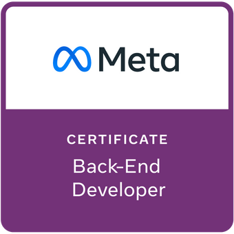

# Meta Back-End Developer Capstone


Building RESTful APIs using [Django Rest Framework](https://www.django-rest-framework.org/) connected to a [MySQL](https://dev.mysql.com/downloads/) as part of the [Meta Back-End Developer Certificate](https://www.coursera.org/professional-certificates/meta-back-end-developer) teached by [Meta](https://www.facebook.com/business/learn/back-end-back-end-developer-certificate-coursera).

<p align="center">
    <a href="https://www.credly.com/org/facebook-blueprint/badge/meta-back-end-developer-certificate">
        
    </a>
</p>

## This project included below features:
```bash
django RESTful API
django authentication management
django template rendering
django class serializers
```

## Steps to run the app

### 1. Install `pipenv` and related lib

```bash
pip install pipenv
pipenv shell
pipenv install django
pipenv install djangorestframework
pipenv install mysqlclient
pipenv install djoser
```

### 2. Edit a setting.py file in the LittleLemon projecy folder

```bash
DATABASE = YOUR_MYSQL_DATABASE_NAME
USER     = YOUR_USERNAME             # default is root
PASSWORD = YOUR_MYSQL_PASSWORD
HOST     = localhost                 # or 127.0.0.1
PORT     = 3306
```

### 3. Make migrations

```bash
py manage.py makemigrations
```

### 4. Migrate

```bash
py manage.py migrate
```

### 5. Run the app

```bash
py manage.py runserver
```

you can test below api:

/restaurant/booking/tables (with POST and after login)

/restaurant/booking/tables (GET)

/restaurant/menu (GET)

/restaurant/menu/<int> (GET)

as it is using mysql server, 
you have to create a user to login, as well as the menu item

you can directly git clone from here: https://github.com/henrytse2468/LittleLemon.git